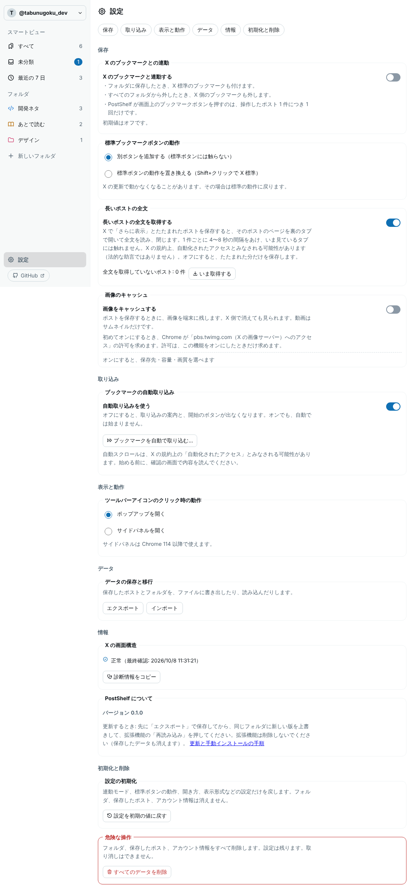

# Installing and updating PostShelf (manual installation)

PostShelf is not distributed on the Chrome Web Store. You use it by loading an unzipped folder in Chrome's developer mode.
日本語: [INSTALL.md](INSTALL.md)

- Extension ID: `aglgbnegdnodlmbmlfmaagjkneokagnc`
  - When installed correctly, this ID is shown for PostShelf on `chrome://extensions`.
  - The ID is derived from the public key embedded in the extension (`key` in the manifest). **It does not change when you move the folder or unzip it somewhere else.** Chrome stores your data per ID.

**The most important rule**: when updating, do **not remove** the extension. Removing it also deletes your saved posts and folders. Overwrite the same folder and press "Reload".

## 1. First installation

1. Get the zip: download `postshelf-x.y.z.zip` from the latest release at `https://github.com/tabunugoku/PostShelf/releases`, or use the zip you were given.
2. Choose a folder and **keep using it from now on**, for example `C:\PostShelf` (or `~/PostShelf` on a Mac). Avoid places you might clean up later, such as Downloads. Unzip into it so that `manifest.json` is directly inside the folder (not in a nested `PostShelf` folder).
3. Open `chrome://extensions` and turn on "Developer mode" (top right).
4. Click "Load unpacked" and select the folder from step 2.
5. PostShelf appears in the list. Check that **its ID matches the ID at the top of this page**.
6. Pin PostShelf from the extensions (puzzle piece) menu in the toolbar.

## 2. Updating (the same steps every time)

1. **Back up**: open the PostShelf manager → Settings → "Data" → "Export" and save the JSON file. (Just in case. Please always do this.)
2. Get the new zip (step 1 above).
3. Unzip it **over the same folder**, overwriting the files. Do not use a different folder.
4. Open `chrome://extensions` and press "Reload" (↻) on PostShelf.
5. Open the manager. A notice "PostShelf was updated (x.y.z)" appears at the top, and the version is shown under Settings → "Data".

Do not do either of these two things.
- **Remove** the extension (this deletes your data too).
- **Change the folder** (use overwrite every time).

## 3. Switching to the fixed-ID version (one time only)

Earlier versions got their ID from the folder you loaded. Moving the folder made Chrome treat it as a different extension, so saved data was not carried over. From this version on the ID is fixed. **As a result, the one time you switch to the fixed-ID version, the data of the old version is not carried over automatically.** Export and import it as follows. For later updates the ID stays the same, so your data stays.

1. **In the old version, export**: manager → Settings → "Data" → "Export". A file named `postshelf-DATE.json` is saved. Make sure the file exists.
   - Screen: 
2. Turn the old version **off** in `chrome://extensions` (or remove it) — only after you have the export file. Having both on would show two buttons on x.com.
3. Install the new version into your chosen folder as in "First installation". Check that the ID matches the one at the top of this page.
4. **In the new version, import**: manager → Settings → "Data" → "Import", and choose the file from step 1. The counts are shown.
5. Once you can see your posts and folders, you can remove the old version.

Notes:
- Cached images (optional feature) are not included in the export (URLs only). Images stored in a folder you chose stay in that folder.
- Settings (such as the standard bookmark button behavior) are not included in the export. Choose them again in the new version.

## 4. A confirmation Chrome may show

When Chrome starts with an extension loaded in developer mode, it may show a confirmation like "Disable developer mode extensions?". This is Chrome's behavior for extensions loaded in developer mode. If it appears, choose "Cancel" to keep using the extension. The wording and the choices differ between Chrome versions.

## 5. Troubleshooting

- **An error when loading**: check that `manifest.json` is directly inside the folder you selected. If the folder is nested one level deeper, select the inner folder. Chrome 114 or later is required.
- **No icon in the toolbar**: pin PostShelf from the extensions (puzzle piece) menu.
- **My data seems to be gone**: most likely a different extension was loaded. Compare the ID on `chrome://extensions` with the ID at the top of this page (`aglgbnegdnodlmbmlfmaagjkneokagnc`).
  - Different ID → you are looking at an old version (from before the ID was fixed). Export from it and import into the new version (see section 3).
  - Same ID → check the account shown at the top left of the manager (you may be viewing another account's data).
- **Updated but nothing changed**: make sure you pressed "Reload" (↻) on PostShelf. Reload open x.com tabs (F5).
- If the display looks wrong because X changed its layout: copy the diagnostic information from Settings → "X page structure" and report it.
